

# **GUI-приложение «Диагностика здоровья» для персонального компьютера на языке программирования Python** 

***Автор разработки:***

*Дорошкевич Виктория Дмитриевна,*

*учащаяся 11 «А» класса*

*УО «Государственная гимназия №1*

*г. п. Зельва»*

Год разработки: 2023
Разработка взяла диплом первой степени XV областного конкурса (конференции) исследовательских работ учащихся «Хрустальная Альфа – 2023».

Источник: https://groiro.by/files/01030/obj/120/64593/doc/%D0%A1%D0%BF%D0%B8%D1%81%D0%BE%D0%BA%20%D0%BF%D0%BE%D0%B1%D0%B5%D0%B4%D0%B8%D1%82%D0%B5%D0%BB%D0%B5%D0%B9%2031.10%20-%20%D0%B8%D0%BD%D1%84%D0%BE%D1%80%D0%BC%D0%B0%D1%82%D0%B8%D0%BA%D0%B0.docx

`             `**РЕЦЕНЗИЯ**

**Актуальность:** здоровье населения является самым важным слагаемым качества жизни и определяет социально-экономическое благополучие и безопасность государства. 

Погруженные в работу и домашние дела, люди порой откладывают поход к врачу. Чтобы решить проблему несвоевременной диагностики организма, медицинские работники готовы объединиться с программистами. Меня вдохновил лекторий от сотрудника НАН, на котором я узнала о благоприятных прогнозах развития онлайн-поликлиники, включая онлайн-рецепты и консультации.

В тот момент ко мне пришла *новаторская идея*. Люди смогут проводить диагностику организма самостоятельно **в домашних условиях** с помощью ряда специализированных тестов, оформленных в **грамотном и доступном** алгоритме в приложении, которое я создам. Один из таких тестов — тест Руфье, который позволяет определить состояние сердечно-сосудистой системы организма. 

Приложение «Диагностика здоровья» имеет огромную **практическую значимость** для всех пользователей данной разработки. Это возможный **вклад** в развитие онлайн-медицины и заботы о здоровье населения. Разработка также может быть использована врачами функциональной диагностики при проведении теста в кабинете лечебной физкультуры для автоматизации расчетов и замеров.

В Год мира и созидания хочется творить и созидать только во благо. Моя **основная идея и цель** — помочь здравоохранению Республики Беларусь в создании условий для сохранения здоровья населения и формировании ответственного отношения населения к сохранению и укреплению собственного здоровья и здоровья окружающих. 

**Новизна:** анализ интернет-источников показал, что приложения для персонального компьютера, *не требующего* постоянный доступ к интернету, на сегодняшний день *не существует* в открытом доступе. Представленные в пабликах алгоритмы теста Руфье не вызывают доверия, тк не подтверждены квалифицированными медработниками.

Как разработчик я несу ответственность за *безопасность использования* приложения, поэтому я обратилась в местное медицинское учреждение за консультацией медсестры кабинета лечебной физкультуры и получила грамотную методику проведения, рекомендации и адаптированные таблицы перевода результата для разных возрастных групп. 

**Перспективы совершенствования:** текущая версия приложения выполняет свою основную функцию. Мне было бы интересно расширить границы проекта и реализовать более масштабную идею. 

В планах добавить в функционал приложения дополнительные тесты: проба Штанге и Генча для оценки функционального состояния дыхательной системы, калькулятор индекса массы тела, чтобы оценить степень соответствия массы человека и его роста, трекер артериального давления, так как порой я замечаю, что люди пожилого возраста мониторят давление, записывая на бумажки, а потом их теряют.

Параллельно с этим ведется тестирование с участием людей разных возрастных групп с целью выявления недостатков в управлении приложением и подтверждения безопасности использования. Я изучаю работу с базами данных, чтобы пользователь имел возможность сравнить текущий результат теста с прошлыми для оценки динамики. 

**ОБЩЕЕ ОПИСАНИЕ РАБОТЫ**

**Характеристики устройства, на котором разработано ПО**

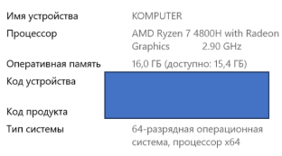

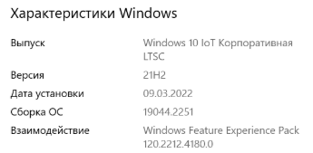

**Требования для установки продукта**

Продукт пригоден для просмотра на персональном компьютере с операционной системой версии не ниже Windows 7.

` `Поддерживаемые архитектуры 32-bit и 64-bit. Процессор мощностью 1,6 ГГц или выше. Для скачивания вам необходимы 50 МБ памяти. 

**Инструменты для разработки приложения**

Приложение создавалось в кроссплатформенной интегрированной среде разработки для языка программирования Python PyCharm Community 2021.1.3. Проект был создан в виртуальной среде, так как для него в последующем установлены пакеты модулей для работы с библиотекой PyQt5.

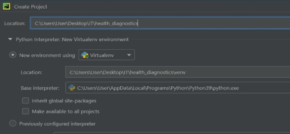

Установка библиотек PyQt5 может произведена посредством базовой конфигурации PyCharm, следуя такому пути: File| Settings | Project: \_\_ | Project Interpreter | + В строке поиска вводим PyQt5, PyQt5-Qt5, PyQt5-sip, PyQt5-stubs и устанавливаем последние версии. Также системные требования Python IDE - установленный интерпретатор языка программирования Python 3.8 и выше. 

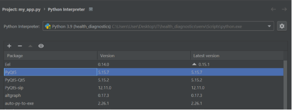

Основные модули, необходимые для работы: **QtWidgets, QtGui и QtCore, QtMultimedia**, **QValidator.**

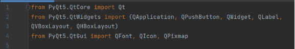

**Логика работы окон приложения**

GUI-приложение «Диагностика здоровья» является многооконным приложением. Я спланировала работу над проектом с помощью инструмента визуализации идей Mind map и чек-листа.
# 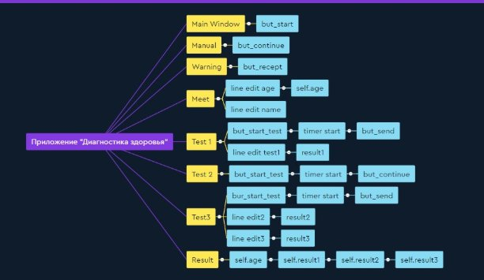
**Рис. 1. Mind-map** 

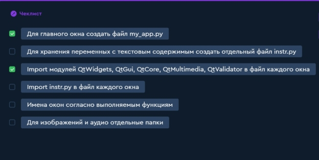
**Рис. 2. Чек-лист** 
**Разработка дизайна приложения** 

` `В первую очередь был сделан упор на логику работу без непредсказуемых ситуаций, а после уже на графический интерфейс. Поэтому для сравнения вы можете увидеть первую версию приложения «Диагностика здоровья», которая значительно уступает текущей версии.

# 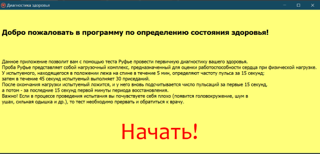
**Рис. 1. Главное окно приложения**

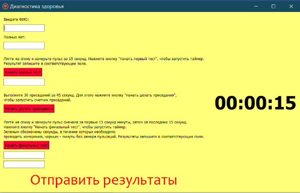** 

**Рис. 2. Окно для ввода измерений**

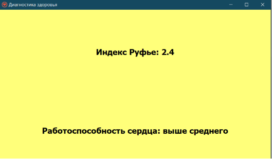

**Рис. 3. Выведение результата**

` `**Дизайн-концепция продукта**

Логотип приложения создан по принципу самых популярных на сегодняшний день продуктов, таких как Viber и Telegram. Гениальность в простом. Логотип яркий и легко остается в памяти пользователя. 

Сущность приложения через него легко раскрывается. У пользователя сложатся правильные ассоциации о функциях приложения. 

Для разработки логотипа была использована программа Paint.  Далее он был преобразован в файл с расширением .ico.

` `«Главным героем» приложения является блестящее алое сердце, его прототип взят со стоков изображений без авторских прав. Герой-помощник проведет вас через весь тест и расскажет о работе вашего сердца. 

Каждое окно выполнено в едином стиле. Для фона выбран приятный светло-желтый цвет, на котором хорошо читается текст. Акцент сделан на кнопки, поэтому для них выбран красный цвет. Кнопки «Начать», «Продолжить», «Ознакомлен», «Отправить результаты» отвечают за переход на другой экран, поэтому они больше остальных и выполнены в другом стиле. 

Когда пользователь начнет одновременно измерять пульс и контролировать время, он не захочет долго вглядываться в монитор, поэтому для виджета таймера использовано полужирное начертание и размер шрифта, в 3 раза превышающий размер основного текста. А также добавлены звуковые сигналы, такие как тиканье секундомера, звоночек об окончании таймера, ритмичная музыка для приседаний.

В каждом поле для ввода предусмотрен временный текст-подсказка. Он особенно нужен в окне для третьего поля, где пользователю предлагается два поля для ввода друг под другом. 

Для наглядности полученного результата я придумала Health Point, в зависимости от индекса Руфье, пиксельная полоса заполнятся на разном уровне. 

**Тестирование продукта**

При запуске приложения открывается первое окно, которое приветствует пользователя и приглашает продолжить. Второе и третье окна предоставляют общее описание метода теста Руфье, алгоритм проведения теста, а также ознакамливают с противопоказаниями и мерами предосторожности. 

Логическая нагрузка начинается, когда приложение взаимодействует с пользователем через ввод данных. Четвертое окно запрашивает у пользователя возраст (один из главных составляющих при проведении теста) и имя. Каждый этап теста оформлен в отдельном окне (пятое, шестое, седьмое окна), что удовлетворяет требованиям к GUI-приложениям. Последнее окно не имеет активных элементов, на нем выводятся обработанные данные, которые передавались, начиная с четвертого окна, и в восьмом окне были подставлены в формулу для расчета индекса. Пользователь видит индекс Руфье, его расшифровку согласно адаптированным таблицам, и совет по сохранению здорового тела.

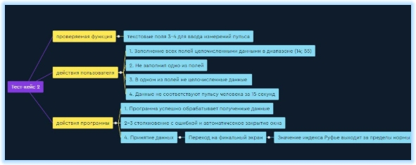
Для проверки работы окон со сложной логикой созданы 3 тест-кейса (к основным функциям приложения, в которых происходит взаимодействие с пользователем. Тестирование дало представление о возможных сбоях в приложении. Анализ дал понять, что приложение рассчитано на внимательного и осознанного пользователя, который не отклоняется от предоставленного алгоритма. Чтобы избежать непредсказуемости, любой ввод пользователя в обязательном порядке должен проверяться программой.

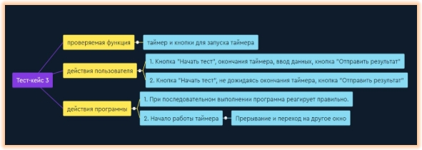

Ответы программы на действия пользователя в тест-кейсе 3 не нарушают логику работы приложения, в отличие от тест-кейсов 1 и 2. Тестирование работы таймера проводится для выявления неудобств работы с приложением. 

**Доработка продукта**

Передо мной стала дополнительная задача – доработка проекта. Решением стало добавить диалоговое окно «Ошибка», которое не даст пользователю отправить результат если: 

1\. Пользователь не заполнил все поля для ввода;

2\. Возраст не соответствует заданному диапазону;

3\. Значение пульса не соответствует заданному диапазону.

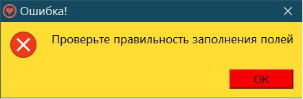

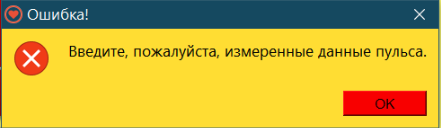

Так же с помощью модуля QValidator поставлены ограничения в поля, где требуются числовые данные:

1\. При попытке ввода букв с клавиатуры поле ввода блокируется;

2\. Возможен ввод только однозначных и двузначных чисел.

Решение проблемы из тест-кейса 3: блокировка кнопок, пока таймер не остановится или появление предупреждающего окна, после случайного нажатия на кнопку.

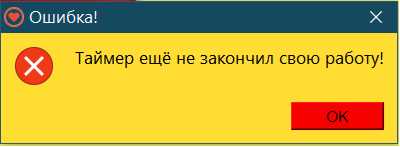

Если возраст человека меньше 7 лет и больше 65, установлено, что проведение теста не безопасно, в случае чего пользователь не выполнит тест.

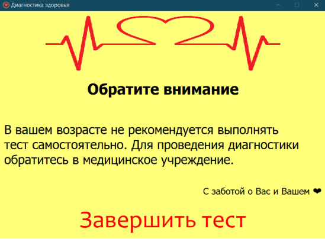

Если значение пульса за 15 секунд меньше 14 или больше 35, продолжение теста невозможно в целях вашей же безопасности. 

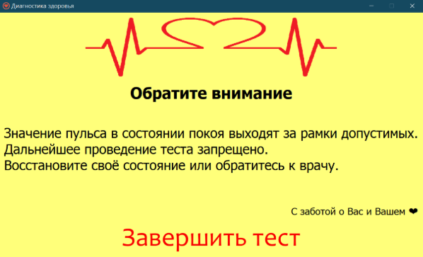

` `Вывод результата варьируется в зависимости от полученного индекса Руфье. Примеры выводов представлены ниже. 

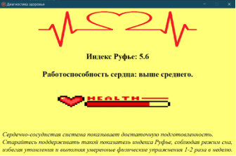

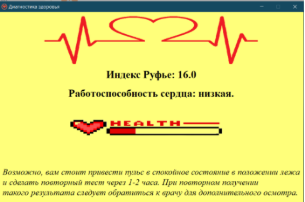

В случае ошибочно введенных данных, в качестве страховки предусмотрено следующее окно:

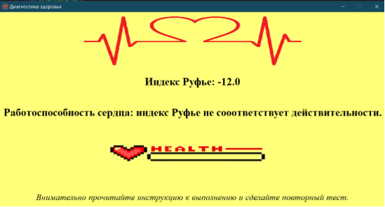

**Преобразование проекта в исполняемый файл .EXE и упаковка его в инсталлятор** 

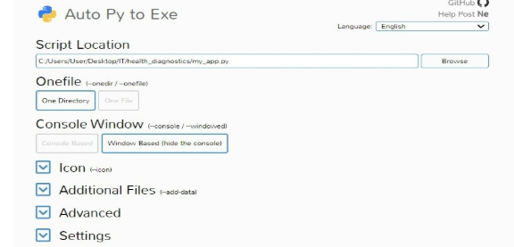Чтобы дать возможность каждому пользователю использовать программу как обычное приложение, нужно собрать проект в исполняемый файл .exe. С этой задачей идеально справится auto-py-to-exe. Запуск auto-py-to-exe осуществляем с помощью терминала в PyCharm. Далее ввод местоположения главного файла, опция выбора «One Directory» или «One File». Мой проект на Python содержит много файлов, но я хочу, чтобы пользователь устанавливал только один главный файл и прилежащие к нему медиафайлы.Так как приложение с GUI, подходящий тип приложения – «Window Based» без консольного ввода. Готовый .EXE файл сохранился в отдельной папке с именем output. Проверка прошла успешно: проект открылся как обычное приложение. 

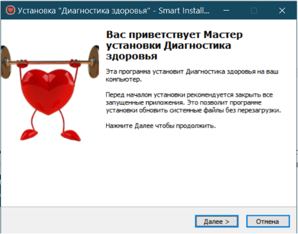

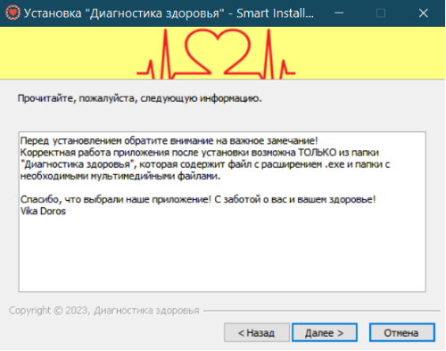

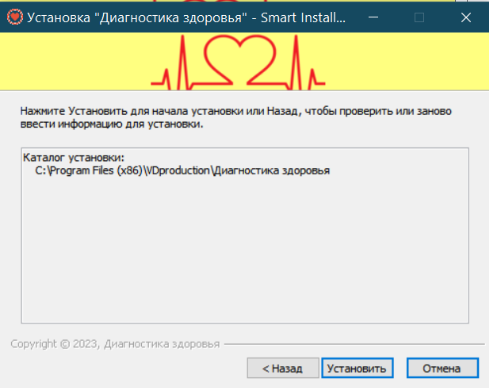

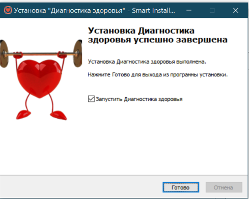
